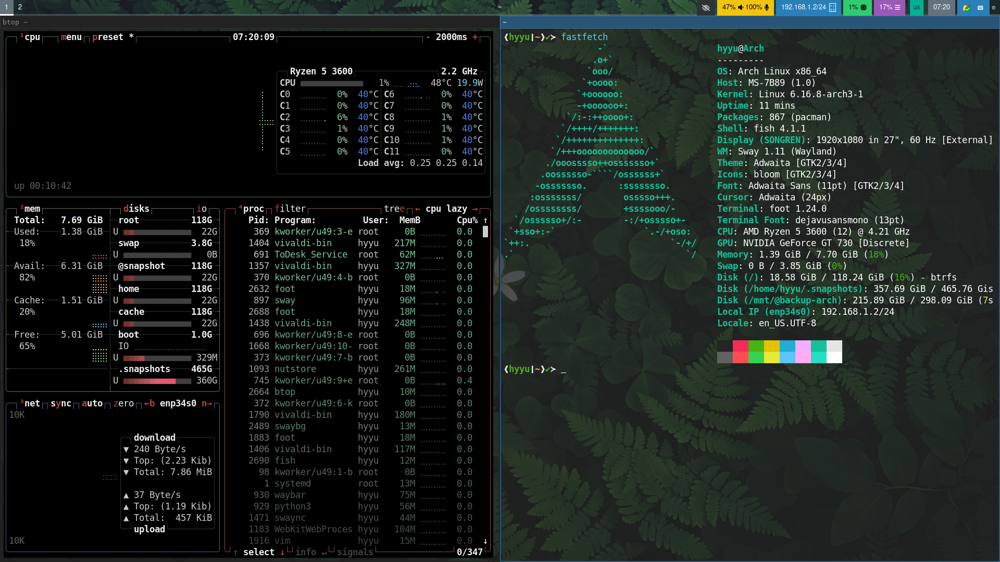

# Archlinux+sway

<h3 align="left" style="margin:0px 0 0px; font-weight:bold; font-size:20px;">2025年9月30日</h3>

---



## 1.Ventoy制作U盘启动盘`
```bash
lsblk -l
```
## 2.Verify the boot mode
```bash
ls /sys/firmware/efi/efivars
dhcpcd
```
## 3.Update the system clock
```bash
timedatectl set-ntp true
```
### net setup
```bash
ip link
iwctl > 无线
ping archlinux.org
```
## 4.Partition the disks
```bash
fdisk -l
fdisk /dev/sdaX  > new GPT
```

|Mount point|Partition|Partition type|Size|
|:---------:|:-------:|:------------:|:--:|
|/mnt/boot  | /dev/efi_system |fat32|1Gb|
|swap  | /dev/swap_partition |swap |4Gb|
|/mnt|/dev/root_partition|btrfs root /|the device|
```bash
mkfs.btrfs -L arch-os /dev/sdc2
#mkswap -L swap /dev/sdc3 #如需要使用休眠则需要创建swap分区
mkfs.fat -F 32 -n boot /dev/sdc1
mount /dev/sdc2 /mnt

#创建子卷，以后可以对子卷进行更细粒化管理：
btrfs subvolume create /mnt/@  #对应/
btrfs subvolume create /mnt/@home #对应/home
btrfs subvolume create /mnt/@cache #对应/var/cache,pacman包缓存
btrfs subvolume create /mnt/@snapshot #对应/.snapshot
btrfs subvolume create /mnt/@data #对应/DATA

umount /mnt
```
zram , 最好用AUR里的 zramswap
```bash
#使用zram-generator
install zram-generator,and create /etc/systemd/zram-generator.conf
/etc/systemd/zram-generator.conf
---
[zram0]
zram-size = 4096
compression-algorithm = zstd
```
## 5.Mount the file systems
```bash
vim /etc/pacman.conf
找到#Color,把#删掉
```

```bash
mount -o compress=zstd,subvol=@ /dev/sdc2 /mnt
mkdir /mnt/{home,var,boot}
mkdir /mnt/var/cache
mkdir /mnt/boot/efi
mount -o compress=zstd,subvol=@home /dev/sdc2 /mnt/home
mount -o noatime,compress=zstd,subvol=@cache /dev/sdc2 /mnt/var/cache
mount /dev/sdc1 /mnt/boot/efi
#swapon /dev/sdc3
```

## 6.Installation
### Select the mirrors
```bash
vim /etc/pacman.d/mirrorlist

https://mirrors.aliyun.com/archlinux/$repo/os/$arch
https://mirrors.cloud.tencent.com/archlinux/$repo/os/$arch
https://repo.huaweicloud.com/archlinux/$repo/os/$arch
```
### 安装系统
```bash
pacman -S archlinux-keyring #更新密钥链
pacstrap -K /mnt base linux linux-firmware
```
### 生成Fstab文件
```bash
genfstab -U /mnt >> /mnt/etc/fstab
```
## 7.setup
```bash
vim /mnt/etc/hostname
#Arch
```
```bash
vim /mnt/etc/hosts
127.0.0.1     localhost
::1                localhost
127.0.1.1    Arch.localdomain Arch  
```
## 8.Chroot
```bash
arch-chroot /mnt
passwd
pacman -S vim sudo
```
```bash
#新建用户
useradd -m -G wheel hyyu
passwd hyyu
visudo
把%wheel ALL=(ALL)ALL的注释取消
```

### Time zone
```bash
ln -sf /usr/share/zoneinfo/Asia/shanghai /etc/localtime
hwclock --systohc #更新bios硬件时间
timedatectl set-local-rtc 1 #set RTC time
```
### Lang and Keymap
```bash
vim /etc/local.gen
en_US.UTF-8
zh-cn.UTF-8

locale-gen
vim /etc/locale.conf
LANG=en_US.UTF-8
vim /etc/vconsole.conf
KEYMAP=us
```

## 9.更新安装软件
```bash
pacman -Syu
pacman -S git gcc pkgconf xorg-xwayland wayland xorg-xinit wpa_supplicant dhcpcd man make vulkan-icd-loader vulkan-nouveau
systemctl enable dhcpcd
pacman -Suyy(全部更新)
pacman -Syu --ignore one --ignore two
ln -s /usr/bin/vim /usr/bin/vi
```

## 10.系统引导启动，部署grub
`intel改amd-ucode为intel-ucode`
```bash
uname -m #确定系统架构
pacman -S efibootmgr amd-ucode  grub os-prober #refind refind-btrfs grub-btrfs
mkdir /boot/grub
sudo grub-mkconfig > /boot/grub/grub.cfg
#bootctl install #systemd-boot
#bootctl update #update systemd-boot 
#refind-install
grub-install --target=x86_64-efi --efi-directory=/boot --bootloader-id=Arch
grub-mkconfig -o /boot/grub/grub.cfg  #每次升级后执行一次此命令，更新内核至最新
```

## 11.sway+apps
### reboot
```bash
sudo pacman -S sway wlroots base-devel swaybg wofi nwg-look grim slurp waybar foot thunar tumbler  vivaldi yazi nfs-utils udisks2 #hyprland
grim -g "$(slurp)"#screenshot
```
###autologin
```bash
#emptty-login manager or display manage
pacman -S emptty
groupadd nopasswdlogin
usermod -aG nopasswdlogin hyyu
#sudo vim /etc/emptty/conf
DEFAULT_USER=hyyu
AUTOLOGIN = true
AUTOLOGIN_SESSION=sway
```

```bash
git clone https://aur.archlinux.org/app.git
cd appdir
makepkg
pacman -U *.tar.zst
```

### archlinuxcn
```bash
vim /etc/pacman.conf
[archlinuxcn]
Server = https://mirrors.tuna.tsinghua.edu.cn/archlinuxcn/$arch
```
```bash
安装'archlinuxcn-keyring'包导入GPG key,才能安装应用
sudo pacman -S archlinuxcn-keying 
pacman -S archlinuxcn-mirrorlist-git
pacman -S paru #aur
=======
导入cn-keyring
sudo pacman -S archlinuxcn-keyring archlinuxcn-mirrorlist-git
#安装aur与cn的应用
paru -S nwg-draw wqy-zenhei wqy-microhei wps-office-fonts wps-office-cn fcitx5-configgur fcitx5-rime fcitx5 wechat tencentdoc linuxqq 
```

### Internet
- Vivaldi-stable
- deepin-network-utils
- tencentdoc
- wechat
- wemeet
- linuxqq
- BBDown/下载网络视频
  
### multimedia
- Handbrake-视频转换
- Audacity
- Inkscape
- Blender
- Gimp/gmic for gimp
- hugin-全景图合成
- darktable-raw图片编辑
- Krita
- Xnviewmp
- qqmusic-bin
- pulsemixer
- pipewire/pipewire-pulse
- etcher
- OBS Studio-录屏
- final2x/图片无损放大修复高清


### Documents
- fcitx5
```bash
pacman -S fcitx5 fcitx5-rime fcitx5-configtool fcitx5-chinese-addons
```

- wps-office-cn
- libreoffice
- gedit \txt文档编辑
- dupeguru\fdupes #diff file
- catfish\快速查找文件
- eudic #欧路词典
- drawio\流程图
- Mupdf\mupdf-tools\mutool  
```bash
mutool merge *.pdf
mutool merge -o out.pdf 1.pdf 2.pdf
mutool draw -o out.pdf *.jpg 
mutool draw -F pdf in.pdf 1,3
mutool draw -r 300 1-%d.jpg in.pdf
mutool draw  -F txt -o 1.txt in.pdf 2,3
mutool convert -o image%d.png in.pdf 1-10
mutool convert -o out.pdf *.png
```
- todesk\远程桌面服务
- Masterpdfeditor-free
- zwcad/gstarcad
- zw3d-bin
- XCHM\chm文件查看器
- pcmanfm/thunar、tumbler#thunar默认缩略图服务
- obsidian/ghostwriter #markdown editor

### Security
- clamav
```bash
sudo freshclam
sudo clamd
clamscan
```
- veracrypt /加密文档

### Fonts
- DejaVuSanSMono
- Hack
- AlibabaPuHuiTi
- simsun
- simhei
- wqy-microhei
- wqy-zenhei
- noto-fonts-cjk
```bash
For a single user, install fonts to ~/.local/share/fonts/
or cp yout-font.ttf /.fonts/
更新字体缓存：
'fc-cache -vf'

#验证安装，查看已安装的字体：
fc-list | grep "fontname"
```

### Utilities
- 左右键切换(xorg)
```bash
xmodmap -e 'pointer = 3 2 1'
xmodmap -e 'pointer = 1 2 3'
```
- file-roller /zstd/unrar/unzip #压缩管理
- yazi/ranger
- [fish](https://wiki.archlinux.org/title/Fish)
```bash
fish_config
fish_update_completions
chsh -s /usr/bin/fish #更换默认shell为fish
```
```bash
- vscodium
- deskreen # Turns any device with browser to a second screen
- weylus # Use tablet as graphic touch screen on computer.
- foot/deepin-terminal
- ntfs3-dkms
- dnsmasq
修改resolv.conf dns为127.0.0.1
防止resolv.conf被覆写，chattr +i /etc/resolv.conf
- pure-ftpd
- mpvpager #play videos as wallpaper
```
```bash
pacman -S bind
dig archlinux.org #test dns
dig archlinux.org @127.0.0.1
```
- git
```bash
git clone git@gitee.com:yuri/config.git #用ssh模式, don't use https
git pull
git add . #put all
git commit -m "update"
git push origin master
```
- exFAT
```bash
pacman -S exfatprogs
mkfs.exfat
```

### Other
- cups/brother-2240d
- timeshift
- usbutils
- sd #替代sed
- awk
```bash
lsusb
```
- udisk2
```bash
#manually mount usb removable drive
$ udisksctl mount -b /dev/sdd1
#TO unmount:
$ udisksctl umount -b /dev/sdd1
```
- fd: Alternative find
```bash
fd name
fd name | grep .pdf
```
- ncdu: Alternative du
- du -sh * #查看文件（夹）大小
- eza: Alternative ls
- aria2/aria2c
- Duf:Alternative df
- Tldr:Alternative man
- ln
- pacman -Sc #清理未安装软件包
- pacman -Scc #清理缓存中所有内容
###备份已安装的软件列表
```bash
pacman -Qqen > packages-extra.txt
pacman -Qqem > packages-AUR.txt
#重新安装
pacman --needed -S - < packages-extra.txt
cat packages-AUR.txt | xargs paru -S --needed --noconfirm
#清理多余软件包
paru -R 'pacman -Qdqt'
```

```bash
ln -sf $HOME/dotfile/fish/config $Home/.config/fish/
```
- deepin-icon-theme
使用nwg-look更换主题
```
paru -S deepin-icon-theme
vim ~/.gtkrc-2.0
gtk-icon-theme-name = "Papirus"
```
```bash
./verysync folder add <path> <key>
./verysync folder list
```
```bash
pdfcrack -f filename.pdf -n 6 -m 8 -c 0123456789 -s #-s 尝试排列密码(目前仅限)支持第一个字符切换为大写) 
pdfcrack -f input.pdf -o -n 6 -m 8 -c 123456 #-o ownerpassword(权限密码) -u userpassword（用户密码，有此密码无法查看文件）
pdfcrack -f high.pdf -w passwork.txt
qpdf --decrypt input.pdf output.pdf #清除权限密码
crunch 6 6 -t pass%% -o pwd.txt #@：小写字母 ，：大写字母 %:数字 ^:符号
```
```bash
time 命令 #统计命令运行时间
```
```bash
#配置文件~/.vimrc
set hlsearch  #高亮search
syntax on     #语法检查
set cursorline
set number
set incsearch
set mouse=a
```

### 有问题的处理方式
`进入usb-livecd`
```bash
arch-chroot /mnt
```

```bash
badlocks -v /dev/sda1 >> bads.txt
smartctl -H /dev/sda1 #smartmontools 
```

```bash
#exec sudo systemctl start vsftpd
```
